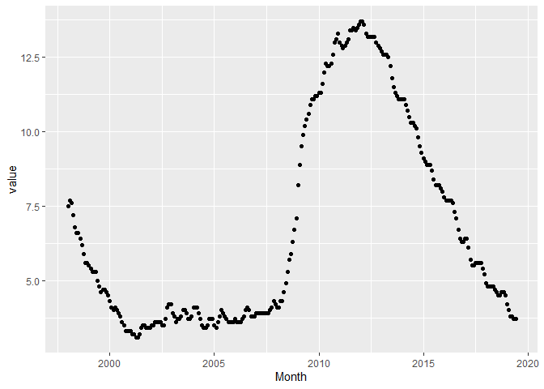
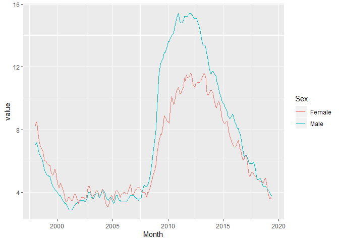
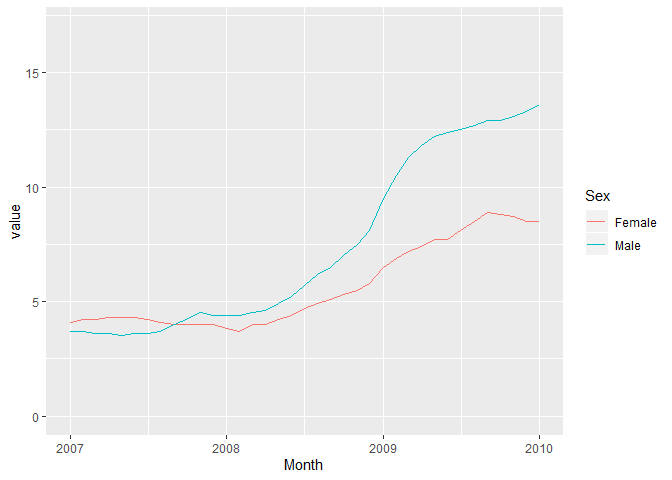
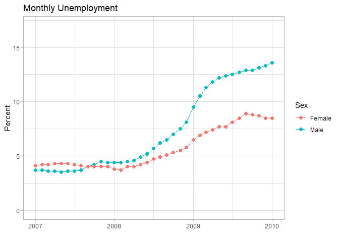

## Introduction and package installation

The main tool within the CSO package is a function `get_cso()`, which allows you to import statistical data directly from the CSO Statbank into the R environment. This document gives a couple of examples using `get_cso()`, and shows how some simple plots can be made.

The CSO package can be installed from GitHub as follows. Note that the function `install_github()` is part of the devtools package, so check that you have that package installed if you encounter any problems.

```r
devtools::install_github("brendanjodowd/CSO" )
library(CSO)
```

The following vignettes require a couple of additional packages:

* dplyr -- Hugely useful package for data handling and manipulation. Includes the pipe: `%>%`
* stringr -- Useful for querying and manipulating strings. 
* ggplot2 -- Make beautiful plots

## Vignette 1 -- Import, Filter, Simple Plots 

__*Topics introduced*__

* Importing with `get_cso()`
* Viewing entries with `unique()`
* `filter()`
* Finding string matches with `str_detect()`
* Keeping and dropping columns with `select()`
* `ggplot()`, along with `geom_point()` and `geom_line()`
* Improving plots with `labs()`, `xlim()`, `ylim()` and `theme_light()`

### Importing data

Each Statbank table has a five character code, and this is used as the argument for `get_cso()`. To begin with, we will import the monthly unemployment data, which has the code "MUM01" on Statbank. 


```r
unemp <- get_cso("MUM01")
```

<details>
  <summary>Tip: Using unique() to view distinct elements in a column </summary>

You can have a quick look at the data frame `unemployment.data` using `head(unemployment.data)`. It contains categorical variables for 'Age.group', 'Sex' and 'Statistic'. Then there is a variable called 'Month', and the numerical data itself is stored in a variable called 'value'. 

If I'm unsure as to what categories are present in each variable, I usually use the function `unique()`, e.g.:

```r
unique(unemp$Sex)
unique(unemp$Age.Group)
unique(unemp$Statistic)
```

```
## [1] "Both sexes" "Male"       "Female"    
## [1] "15 - 24 years" "15 - 74 years" "25 - 74 years"
## [1] "Seasonally Adjusted Monthly Unemployment (Thousand)"
## [2] "Seasonally Adjusted Monthly Unemployment Rate (%)"
```

</details>

The time variables found in CSO Statbank tables include Year, Quarter and Month. Month comes in as a date, while Year arrives as a simple numeric variable. Quarter is of the form (e.g.) 1996Q1.

### Filtering data

Let's use `filter()` to examine the unemployment rate for both sexes, among 15 to 74 year-olds. To restrict the variable Statistic to just 'Seasonally Adjusted Monthly Unemployment Rate (%)', we could of course filter Statistic equal to this string. Instead, to save space, I use the function `str_detect` with the phrase "Rate" which appears in just one of the two categories of Statistic. 

We can also use `select()` to choose only the variables 'Month' and 'value'.

```r
unemp1 <- unemp %>% 
  filter(Age.Group == "15 - 74 years") %>% 
  filter(Sex=="Both sexes") %>% 
  filter(str_detect(Statistic , "Rate"))
```

### Simple plots

We'll use ggplot for plotting as this has a wide array of formatting options. The first argument is the name of the dataset itself. Then the x and y variables are indicated within the `aes()` function. We can specify a scatter plot using `+ geom_point()` as below, or a line plot using `+ geom_line()`

```r
ggplot(unemp1, aes(Month, value)) + geom_point()
```

<!-- -->

Suppose we wanted to compare Male and Female unemployment over this period. We can make a very slight adjustment to our previous code, adding an exclamation mark before `Sex=="Both sexes"` to exclude this category, leaving the categories for Male and Female.

```r
unemp2 <- unemp %>% 
  filter(Age.Group == "15 - 74 years") %>% 
  filter(!Sex=="Both sexes") %>% 
  filter(str_detect(Statistic , "Rate"))
```
Now we can use `colour=Sex` in the `aes()` function to give the Male and Female categories different colours:

```r
ggplot(unemp2, aes(Month, value, colour=Sex)) + geom_line()
```

<!-- -->

Try using `+ facet_wrap(vars(Sex))` to produce an array of plots. One nice thing with `facet_wrap` is that all axes have the same limits.


### Limits and labels

There are a couple of ways to set limits on the dates in the plot. One way is to filter the data itself using another `filter()` statement, like `filter(Month >= as.Date("2007-01-01"))`, which will provide output only since 2007. Note the use of `as.Date()`, and that the date is expressed in the form YYYY-MM-DD, which is the default for the `as.Date()` function. Another way is to use `+ xlim()` in the ggplot statement, as shown in the following example. I'm also specifying y-limits of 0 to 20 here using ` + ylim(0,20)`. 

```r
ggplot(unemp2, aes(Month, value, colour=Sex)) + geom_line() +
  xlim(as.Date("2007-01-01"),as.Date("2010-01-01")) + 
  ylim(0,20)
```

<!-- -->

Let's finish up by using `labs()` to add labels, and adding `+ theme_light()` to give the graph a different look. You can look at some of the other themes that are available [here](https://ggplot2.tidyverse.org/reference/ggtheme.html). I'm including both `geom_line()` and `geom_point()`, with the points assigned a size of 2. 

```r
ggplot(unemp2, aes(Month, value, colour=Sex)) + geom_line() + geom_point(size=2) +
  xlim(as.Date("2007-01-01"),as.Date("2010-01-01")) + 
  ylim(0,17) +
  labs(x = "", y="Percent", title="Monthly Unemployment") +
  theme_light()
```

<!-- -->


## Vignette 3 -- Columns and Creating new variables

__*Topics introduced*__

* Creating and changing variables with `mutate()`
* `geom_col()`, and flipping this using `+ coord_flip()`
* `geom_area()`
* Plotting categories in order of value using `reorder(category, value)`


### Importing and filtering

Suppose I want to examine the numbers of burglaries in West Dublin. I start by importing the file with annual crime statistics, which has the code 'CJA07'. This includes the variables 'Garda.Station', 'Type.of.Offence', 'Year', 'Statistic' and 'value'. I can find just those Garda stations in the western part of the Dublin Metropolitan Region (D.M.R.) by filtering matches to the string 'D.M.R. Western'. Then I find matches to 'Burglary' in 'Type.of.Offence', anbd restrict to only the years 2012, 2014 and 2016. Next, I want to `mutate` the names of the Garda stations -- they all include the words ' Division, D.M.R. Western' after the town name which I feel is redundant, so I select just the first word in 'Garda.Station' using `word()`, which is a function from the stringr package. Finally, I remove two redundant variables (Statistic and Type.of.Offence).


```r
dublin_crime <-  get_cso("CJA07") %>% 
  filter(str_detect(Garda.Station, "D.M.R. Western")) %>% 
  filter(str_detect(Type.of.Offence, "Burglary")) %>% 
  filter(Year %in% c(2012, 2014, 2016)) %>% 
  mutate(Garda.Station = word(Garda.Station, 1, sep=",")) %>% 
  select(-Statistic, -Type.of.Offence) 
```

### Line and column plots

Now let's plot the number of burglaries for each of these stations by year.


```r
ggplot(dublin_crime , aes(Year, value, colour=Garda.Station)) + geom_line()
```

<!-- -->

To do a column chart or bar chart, I always use `geom_col()`. You can use `geom_bar()`, but that's designed for counting instances of each entry, and needs a special statement to plot a particular value. 


```r
ggplot(dublin_crime , aes(Year, value, fill=Garda.Station)) + geom_col()
```

<!-- -->

Notice that `fill = ` is used instead of `colour = `. In R, `colour` always refers to lines whereas `fill` refers to the colour of shapes. You can make grouped rather than stacked columns by using `geom_col(position = "dodge")`, and 100% stacked columns using `geom_col(position = "fill")`. You can also make a stacked area plot by using `geom_area()` instead of `geom_col()`.

Try swapping `Year` with `Garda.Station` in your column plot code so that the primary grouping along the axis is by Garda Station. You will notice that the fill colour is a gradient and that the dodge option is no longer possible. This is because `Year` is a numerical variable. You can use `mutate` to convert it to a factor or a string, or simply wrap `Year` in the function `factor()` to use it as a factor. Here we also create a horizontal chart by adding `coord_flip()`. 


```r
ggplot(dublin_crime , aes(Garda.Station, value, fill=factor(Year))) + 
  coord_flip() +
  geom_col(position="dodge")  
```

<!-- -->


### Making new variables based on aggregate data.

Very often, we will want to find the average (or median, or max...) for a group within our dataset. We might also want to compare individual values with averages for their group. This is done using `group_by` in combination with either `summarise` or `mutate`. 

Let's take the first problem and calculate the average number of burglaries per year for each Garda Station:

```r
dublin_averages <- dublin_crime %>% 
  group_by(Garda.Station) %>% 
  summarise(avg.burglaries = mean(value))

dublin_averages
```

```
## # A tibble: 8 x 2
##   Garda.Station  avg.burglaries
##   <chr>                   <dbl>
## 1 Ballyfermot              205 
## 2 Blanchardstown           672.
## 3 Cabra                    121 
## 4 Clondalkin               316.
## 5 Finglas                  264 
## 6 Lucan                    226.
## 7 Rathcoole                119.
## 8 Ronanstown               210.
```

Notice that this contains one row for each Garda Station. Now let's look at the second option, where we want to calculate the mean for each Garda Station, but keep each of the original rows so that we can compare the means to the original data:


```r
dublin_averages_2 <- dublin_crime %>% 
  group_by(Garda.Station) %>% 
  mutate(avg.burglaries = mean(value))

head(dublin_averages_2)
```

```
## # A tibble: 6 x 4
## # Groups:   Garda.Station [2]
##   Garda.Station   Year value avg.burglaries
##   <chr>          <dbl> <int>          <dbl>
## 1 Blanchardstown  2012   791           672.
## 2 Blanchardstown  2014   694           672.
## 3 Blanchardstown  2016   532           672.
## 4 Cabra           2012   136           121 
## 5 Cabra           2014   149           121 
## 6 Cabra           2016    78           121
```

We can now make a new variable called 'Status', equal to 'Above', 'Below' or 'Same' depending on the relationship between each value and the average for that Station. Here we will use the function `case_when`. Very often you see a different function: `if_else()` (or `ifelse()` in base R). I don't like `if_else()`if there are more than two options because you end up with very complicated nested functions, whereas with `case_when` the different options are neatly separated by commas. 


```r
dublin_averages_3 <- dublin_averages_2 %>% 
  mutate(Status = case_when(
    value > avg.burglaries ~ "Above",
    value < avg.burglaries ~ "Below",
    value == avg.burglaries ~ "Same"
    )
         )

head(dublin_averages_3)
```

```
## # A tibble: 6 x 5
## # Groups:   Garda.Station [2]
##   Garda.Station   Year value avg.burglaries Status
##   <chr>          <dbl> <int>          <dbl> <chr> 
## 1 Blanchardstown  2012   791           672. Above 
## 2 Blanchardstown  2014   694           672. Above 
## 3 Blanchardstown  2016   532           672. Below 
## 4 Cabra           2012   136           121  Above 
## 5 Cabra           2014   149           121  Above 
## 6 Cabra           2016    78           121  Below
```
